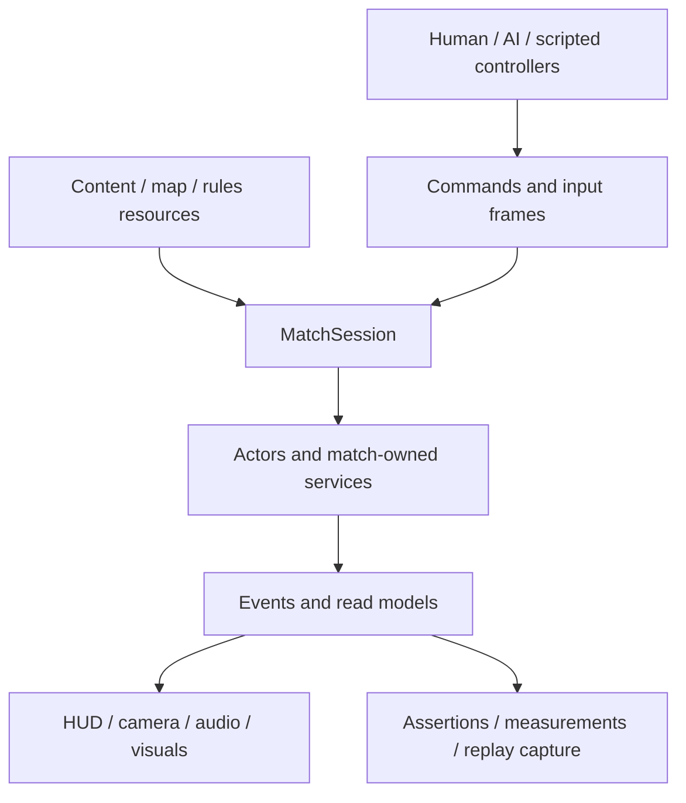

# Crownfront architecture rebuild plan

Status: planning complete; gameplay implementation has not started. Decisions incorporate the October 1, 2026 repository review and verification run.

## Outcome and decisions

Make units, attack behaviors, upgrades, maps, and match rules easier to extend, with explicit ownership and reliable verification. Rebuild incrementally and keep a playable default match at every stage.

Use a modular Godot core: retain GDScript and authoritative actor nodes, extract focused gameplay components and match-owned services, and make presentation optional. Desktop and mobile receive equal architectural attention; Android builds and device checks are included, while native iOS validation is deferred. Target 60 FPS on a recorded midrange Android device and provide a 30 FPS presentation option. Extension examples remain test fixtures.

Retain current balance, default army caps, English/Russian support, procedural art, settings persistence, and the two-team/four-commander default. Networking, rollback, exact command-log replay, save/load, an ECS migration, and an engine replacement are excluded.

| Direction considered | Benefit | Decision |
| --- | --- | --- |
| Split existing code into more managers | Small initial changes, but broad dependencies can survive | Insufficient on its own |
| Match-owned services and reusable actor components | Focused changes, reusable content, isolated tests, optional presentation | Selected |
| Separate simulation with plain entity state or ECS | Stronger foundation for enormous battles and networking | Revisit when those requirements exist |

This design applies Godot's recommendations for independent scenes and injected dependencies. It is an architectural recommendation for this project, not a requirement imposed by the engine. [Scene organization](https://docs.godotengine.org/en/stable/tutorials/best_practices/scene_organization.html)

## Evidence and problems to address

Baseline source: `c7066a7bd4ef80d1bb1c700382194ece305fee5e`. Verification used Godot `4.7.2.stable.arch_linux.ed1daf0bf` on Linux, Intel i7-7700, with Intel HD Graphics 630 for the native render check. Runtime tests ran in a temporary copy of the 149 tracked files, with isolated preferences. Raw results are local, ignored artifacts under `tests/artifacts/architecture_baseline/`, including `summary.json`, `matches.json`, and `matches.html`. These generated files are not included in a fresh clone; the table below preserves the relevant baseline results in source control.

| Existing check | Fresh result |
| --- | --- |
| Project validation | 71 Godot files, 76 resource paths, seven inputs pass |
| Localization validation | 174 bilingual keys and placeholder/reference checks pass |
| Python scenario/report tests | 5/5 pass |
| Engine import | Completes with no errors in the final isolated run |
| Runtime smoke / tactical / movement lab | 90/90, 12/12, 20/20 pass |
| Route travel / navigation parity | Zero route failures; 15,500 navigation cases pass |
| Localization runtime | 14/14 pass; four audio objects leak at shutdown |
| Settings/audio / onboarding / headless polish | 40/40, 24/24, 23/23 pass |
| Seed 42, production scene at fixed 60 Hz | Ember wins at 761.35 simulated seconds |
| Seed 43, production scene at fixed 60 Hz | Ember wins at 1240.67 simulated seconds |
| Seed 44, production scene at fixed 60 Hz | Reaches the 1800-second simulation limit with no winner |
| Replay consistency | All three captures pass the existing validator |
| Offline replay browser checks | Playback, final stop/restart, seek, markers, tooltips, speed, run switching, responsive layout, legacy replay, and technical-failure presentation pass |
| Native Russian battle capture | Captures 917×1030 after compositor resizing; does not verify the requested 1280×720 layout |

These results establish a functional starting point for the covered scenarios. Three automated matches do not establish balance, human usability, cross-platform determinism, or mobile performance.

The code review and diagnostics identify concrete migration work:

- `game_manager` combines composition, purchases, spawning, lifecycle, navigation access, spatial indexing, UI notices, audio, and effects. Actors receive this broad dependency.
- AI, income, and match time use render callbacks while combat uses physics callbacks. Several tests reconstruct that schedule by calling private methods.
- Combat actors combine targeting, damage, movement, animation timers, drawing, and sound. Many systems classify units by the three existing content IDs.
- Map bounds, route counts, grid dimensions, mirrored placements, and AI lane thresholds are hardcoded across gameplay and presentation. Replay validation also assumes the current map's dimensions and pad count.
- The HUD reads `WORKER_COST`, although scenarios can change the effective `worker_cost`. It separately reproduces purchase availability rules.
- The localization shutdown warning reproduces with verbose logging: two `AudioStreamWAV` and two `AudioStreamPlaybackWAV` instances remain. Their origin is not established; the lifecycle stage must investigate and eliminate the warning.
- The visual harness compares captured pixels to the current window size, rather than the requested dimensions. A compositor-resized capture therefore passes.
- The headless performance fixture manually steps actors but omits projectile updates. Its 900 samples measure 4.287 ms mean / 8.256 ms p95, while nodes rise from 322 to 738. A separate diagnostic confirms 151 projectiles remain unable to process after six simulated seconds. These timings are **not a complete gameplay performance baseline**.
- The match runner can return process success after recording a technical failure. Its `failures` report field is constant zero. Exit status and this field cannot independently prove success.

## Architecture and interfaces

### Match ownership and lifecycle

- Introduce `MatchSession`, created and wired by the application scene. It owns teams, controllers, actor registry, command processing, economy, navigation/spatial services, and victory policy. `game_manager` becomes a composition root with temporary adapters during migration.
- Use explicit `INITIALIZING`, `RUNNING`, `PAUSED`, `FINISHED`, and `STOPPED` states. Session lifecycle owns pause, completion, restart, teardown, and command cancellation. App-wide preferences/localization remain autoloads; audio playback is initialized through an optional presentation adapter.
- Expose `start(config: MatchConfig)`, `submit(command: MatchCommand) -> int`, `step()`, and `stop()`. `step()` always represents 1/60 second. Godot's live physics callback and the accelerated runner invoke the same method. Actor callbacks must not also advance gameplay.
- Advance timers/income, sample controller decisions, drain commands, refresh spatial state, update actors in stable match-ID order, refresh spatial state again, update projectiles, clean up, then publish events. Presentation has independent frame updates.
- Mark a lethally damaged actor unavailable immediately; remove its node during cleanup. The first King defeat resolves the default match once, and later gameplay work in that tick is skipped. Result presentation can continue while gameplay is frozen.
- Pause/finish/stop cancels queued gameplay commands with a completion result, clears held input, and prevents stale actions on resume. Restart disposes the old match before starting the next one. Disconnect subscribers and release match references explicitly.

### Commands, read models, and events

- Introduce typed command payloads for recruitment, upgrades, building, movement, attacking, and interaction. `CommanderInputFrame` carries movement and attack/interaction intentions; controllers never directly mutate bodies or create actors.
- Submission returns a monotonic receipt ID. `command_completed(receipt_id, result: CommandResult)` reports exactly one completion; failure reasons include invalid state/actor/content/route, insufficient resources, caps, range/access restrictions, and maximum upgrade level. Commands submitted outside `RUNNING` complete as rejected without needing a gameplay tick.
- Drain accepted commands FIFO; AI controllers submit in commander-ID order. Validate at execution, including whether the requester is a member of the team being charged. Resolve payment and creation once; unsuccessful creation must restore payment and counts.
- Recruitment always carries a route ID. Selected route and local observer/commander identity belong to controller/presentation state, rather than global match defaults.
- Provide authoritative action availability queries. Shop price, affordability, caps, build access, and upgrade limits use the same rules as execution. UI receives typed read models, never mutable team/entity collections.
- Publish match-owned events for creation, purchases, attacks, damage, deposits, upgrades, deaths, respawns, and results. Events contain stable IDs and values needed after an actor is removed. Observers cannot re-enter gameplay mutation while events are being published; submitted actions wait for the next command drain.

### Actors and queries

- Keep actor nodes authoritative. Extract reusable health/damage, attack execution, and navigation helpers. Preserve focused commander, army, worker, King, and tower behavior.
- Separate content identity from actor category and tactical role. Army counts, siege targeting, ranged behavior, icons, and replay capture must not depend on a closed list of unit IDs.
- Define `AttackDefinition` for damage, range, cooldown, windup, instant/projectile delivery, and structure multiplier. Specialized attacks implement the same execution contract rather than adding content-ID branches to shared combat.
- Move drawing, animation timers, camera behavior, audio selection, and effect budgets into presentation components. Core actors run without HUD, drawing components, cameras, audio voices, or effects.
- Maintain a match-owned registry for actors, resources, and structures. Spatial queries enumerate every cell intersecting the requested radius or swept segment, then apply existing exact range, body-radius, terrain, and line-of-sight checks. Use stable-ID tie breaking. Navigation remains main-threaded initially.

### Content, maps, and compatibility

- Extend the existing resource workflow with a `ContentCatalog`, `MapDefinition`, `MatchRules`, and `MatchConfig`. A catalog entry associates a unit definition with actor scene, behavior, presentation, and localization keys. Treat authoring resources as read-only; copy mutable values into match-owned state. [Godot resources](https://docs.godotengine.org/en/stable/tutorials/scripting/resources.html)
- Map definitions own bounds, obstacles, named routes, team bases/spawns, resources, and build pads. Route direction is explicit per team. Grid dimensions derive from bounds; AI chooses lanes using route geometry rather than fixed Y thresholds. Battlefield drawing, minimap, navigation, and capture share the resolved definition.
- Rules own starting resources, caps, commander slots, income/respawn settings, and victory policy. Production defaults remain today's King battle. Keep two-team ownership in this rebuild; maps can have different route/pad counts.
- Validate references, duplicate IDs, numeric bounds, stat keys, route/spawn validity, localization, and scenario overrides before creating actors. Unknown fields must fail visibly. Editor configuration warnings expose missing dependencies.
- Preserve version-1 scenario semantics through an adapter. Introduce version 2 for explicit map/rules/catalog selection. Record the fully resolved configuration, engine/build identity, fixed step, and seed.
- Introduce replay version 3 for explicit entity definition/category metadata and ticks. Normalize legacy version-1/2 captures in the viewer. Validate geometry against the recorded map definition; retain current replay consistency checks. Capture lifecycle events at their source rather than discovering actors on the next sampled frame.
- Group new code by gameplay feature. Move existing resources/scripts alongside substantive changes, retaining Godot UIDs and updating references. Avoid an unrelated mass rename.

## Migration stages and exit gates

| Stage | Implementation | Required evidence before advancing |
| --- | --- | --- |
| 1. Verification foundations | Pin Godot 4.7.2 and matching templates; add isolated verification runner, reliable outcome/log checks, exact viewport assertions, and projectile-inclusive performance sampling | Fast suite passes; corrupt-settings diagnostics are specifically accounted for; full reports distinguish wins, simulation limits, and technical failures; a valid fresh performance baseline is recorded |
| 2. Match ownership and presentation | Extract lifecycle/session; introduce match events and optional presentation; investigate audio shutdown; retain migration adapters | Pause/result/restart remain playable; repeated teardown releases subscriptions, actors, queued commands, and playback; presentation-disabled matches run without presentation objects |
| 3. Production stepping and commands | Move all gameplay timers into `step()`; introduce controller intentions and validated commands; migrate tests off private callbacks | Live and accelerated runs share the step; no double ticking; payment/cancellation tests pass; same command trace/seed yields matching gameplay states with presentation on/off and at 30/60 FPS |
| 4. Reusable actors and definitions | Extract components and registries; add catalog/map/rules definitions; update AI, HUD, scenario tooling, and replay adapters | New content and variable-route map fixtures pass without new content-ID branches in session/HUD; navigation parity and old scenario/replay compatibility pass |
| 5. Desktop/Android foundations | Responsive HUD, touch/lifecycle adapters, platform exports, CI gates, contributor guides; remove obsolete adapters | Actual desktop packages and Android debug APK pass smoke tests on their target platforms; bilingual phone/tablet layouts and a sustained Android match are reviewed; extension walkthroughs are reproducible |

The fixed-step migration intentionally changes scheduling. Preserve gameplay rules and tuning, but review and record new match trajectories rather than forcing old winning times or silently changing balance to make a timeout disappear.

### Test-only extension proofs

- Register a new siege-archer unit by catalog/resource: ranged projectile attack with structure priority, existing ranged presentation, and independent stats. Add a short burst attack implementation through the attack contract as a separate fixture.
- Load an alternate map with different bounds, two routes, non-mirrored spawns, and a different pad count. Verify travel, AI route selection, minimap geometry, purchases, and replay capture.
- Load a rules variant with a deadline: King defeat still ends immediately; at the deadline, compare remaining King-health fractions, with equality producing a draw. Cover both winner and draw outcomes. This mode stays out of the shipped catalog.

## Verification contract

Add `python3 tests/verify.py --suite fast|full|desktop|android --godot /path/to/godot --output DIRECTORY`. The runner stages source/imports and uses isolated XDG data/config/cache roots. It writes a machine-readable summary with commit, engine, configuration, commands, assertions, outcomes, diagnostics, and artifact paths. It exits nonzero on assertion failures, invalid reports, unexpected script/runtime errors, or technical failures; expected negative-fixture errors are matched narrowly. A missing required device/toolchain is an explicit unmet platform gate, never a pass.

| Suite | Coverage |
| --- | --- |
| Fast, every change | Static references/localization/content, Python tests, engine import/parse checks, existing headless regressions, command atomicity/rejections, lifecycle cancellation, counts, finite state, and fast extension fixtures |
| Full, integration changes | Fixed-60-Hz production stepping; seeds 42/43/44; a repeated seed/command trace; normal and swapped asymmetric scenarios; presentation and render-rate parity; navigation/terrain and projectile assertions; replay JSON/browser checks; repeated-match teardown |
| Desktop, presentation/release changes | Rendered polish and real-input regressions; full English/Russian capture matrix; requested dimensions compared directly with actual pixels; visually inspect captures; 115-actor rendered stress and soak; native export launch/restart/settings/package checks |
| Android, platform/release changes | Build/install/launch debug APK; movement plus shop/interact multitouch; system Back; focus/background/resume; safe areas; phone/tablet layouts; real-device sustained match and thermal measurements; settings persistence |

Cover double spending by teammates, unaffordable/capped requests, payment followed by creation failure, invalid/removed actors or pads, stale attack targets, friendly fire, projectile sweeps, worker overdraw, immediate upgrades, repeated death/result handling, and commands cancelled by pause/end/restart. Compare copied state after failed commands, not just their return codes.

Existing seed 44 times out at the simulation limit; report this baseline outcome explicitly. Technical failures always fail. Investigate changed timeout/progression behavior during migration rather than treating every simulation limit as a crash or an automatic balance verdict. Do not use the current hardcoded `failures: 0` field as an assertion count.

For performance comparisons, run the corrected baseline and candidate alone on the same device/engine/fixture, with warmup and identical capture settings. Record p50/p95/max tick and frame times, actor/projectile/effect counts, memory, and teardown counts. Run three measurements when accepting a performance change. Target 60 FPS presentation and a 60 Hz gameplay step at current caps; the 30 FPS presentation option must preserve the same gameplay trace. A desktop or emulator result cannot satisfy the mobile target.

Initial responsive layout cases are desktop 1280×720, 1280×800, 1920×1080, plus landscape phone 1600×720 and tablet 1280×960. Test both locales and simulated cutouts, then verify on real devices. Use at least 48dp touch targets, following [Android's touch-target guidance](https://developer.android.com/guide/topics/ui/accessibility/views/apps-views), and convert safe-area coordinates into viewport coordinates. Preserve landscape orientation. Backgrounding a mobile match pauses and clears input; foregrounding requires explicit resume. Process termination starts a fresh match on relaunch and retains preferences; match save/resume is excluded. [Multiple resolutions](https://docs.godotengine.org/en/stable/tutorials/rendering/multiple_resolutions.html)

## Platform prerequisites and delivery

Godot 4.7.2 is the selected development/CI engine. Update documentation and export-template checks together. Historical Godot 4.6.2 macOS results remain historical evidence, rather than being relabeled as current validation.

Keep the Compatibility renderer. Establish native Linux, macOS, and Windows desktop build/smoke jobs; the current host can directly verify Linux. Android uses an arm64 debug APK for device checks, with export templates matching the pinned engine, OpenJDK, Android SDK, and platform tools provisioned in the build environment. These tools/templates are absent from this host at review time. Use the engine-version-specific export requirements when provisioning. Store credentials outside tracked presets; this plan does not publish to app stores. [Android export requirements](https://docs.godotengine.org/en/stable/tutorials/export/exporting_for_android.html)

iOS receives reusable layout, safe-area, input, and lifecycle boundaries in this rebuild. Native iOS export/device acceptance remains deferred; it requires macOS, Xcode, and export templates. [iOS export requirements](https://docs.godotengine.org/en/stable/tutorials/export/exporting_for_ios.html)

CI blocks merges on the fast suite, runs full integration checks for core changes, and runs native export checks on their platform workers. Physical Android checks are a release gate with recorded model/OS/settings and at least a ten-minute sustained session. Preserve production-only packaging, license notices, and tests/editor-tool exclusions. Future low-level server or threading work requires a measured bottleneck and a separate design review. [Server optimization](https://docs.godotengine.org/en/stable/tutorials/performance/using_servers.html), [thread-safe APIs](https://docs.godotengine.org/en/4.6/tutorials/performance/thread_safe_apis.html)

Deliver the session/components/resources, verification runner and CI, compatibility adapters/tests, production build scripts, and short contributor walkthroughs for a unit, specialized attack, upgrade, map, and rules variant. Completion requires the default game to remain playable, extension proofs to pass, obsolete adapters to be removed, and the required platform gates to have actual evidence. Planning completion does not assert that any of those implementation deliverables already exist.
